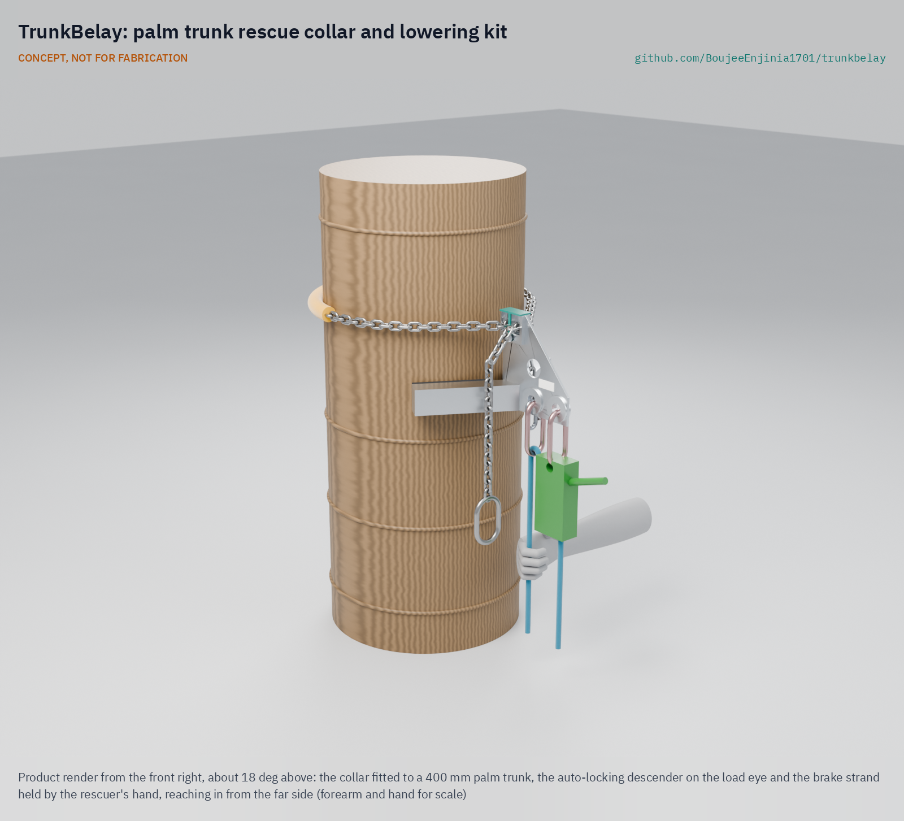
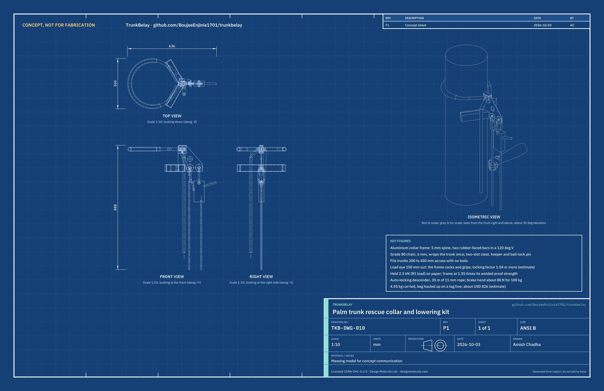

# TrunkBelay

     

**Area:** Food and water security · **TRL:** 3 of 9 (analytical proof of concept, constructable design) · **Value-engineering target:** USD 900; estimated cost of the constructable design USD 826 (USD 74 under the target) · **Difficulty:** 3 of 5

Lets a fellow climber anchor and lower a climber stranded high on a palm trunk.

## Concept rationale

TrunkBelay gives a second climber, usually a fellow plucker who is already on site, the means to act. It is a kit of a chain-and-cleat collar and a rope. The rescuer climbs the trunk, fixes the collar round the palm below the stranded climber, clips the climber to the rope, takes their weight through a friction device on the collar, frees them from their climbing device and lowers them to the ground under control.

Collars that grip a pole are familiar to utility linemen, and the industry sells dedicated pole-top rescue kits and training aids ([Buckingham](https://buckinghammfg.com/products/supersqueeze-pole-top-rescue-488p/)). Coconut climbers have neither the kit nor the training. An open, low-cost design that local workshops can build, with a simple drill that fire services and climber training programmes can teach, closes that gap. It is published as an open engineering reference, not certified rescue equipment.

## Burning platform

Climbing is dangerous work. In a study of 220 coconut tree climbers in rural Kerala and Tamil Nadu, 35.5 % had fallen at least once, the survey recorded four deaths from falls, and 18 of the 19 climbers who left the trade did so because of occupational injury ([George et al., JCDR, 2012](https://www.jcdr.net/article_fulltext.asp?id=1829)). In Tanzania, a referral hospital treated 44 men with spinal injuries after coconut tree falls over five years; 47.7 % had complete injuries at admission ([World Neurosurgery, 2023](https://www.sciencedirect.com/science/article/abs/pii/S1878875023004023)).

Falls are not the only emergency. In Kerala, climbers regularly end up suspended head down from their climbing devices. In September 2025, a plucker hung upside down for about 150 minutes on a 70 ft (21 m) palm ([Onmanorama, 2025](https://www.onmanorama.com/news/kerala/2025/10/02/coconut-plucker-hanging-upside-down-rescued-by-friend-firefighters.html)); in January 2026 another hung for about 30 minutes after his device's cables slipped on a curved palm ([Onmanorama, 2026](https://www.onmanorama.com/news/kerala/2026/01/31/coconut-tree-man-trapped-fire-rescue.html)); in February 2026 a third was caught by a fire officer when his leg came free of the device ([Onmanorama, 2026](https://www.onmanorama.com/news/kerala/2026/02/08/fire-officials-save-60-year-old-man-hanging-upside-down-coco.html)). India's Coconut Development Board runs an accident insurance scheme specifically for climbers ([PIB, 2022](https://www.pib.gov.in/PressReleasePage.aspx?PRID=1880306&reg=3&lang=2)), which shows the risk is recognised; insurance pays after the event, but it does not bring anyone down.

## Where it could be used

### By industry

| Industry | Use |
| --- | --- |
| Coconut and palm harvesting | Peer rescue of a climber stranded or unconscious on the trunk |
| Fire and rescue services | A light trunk anchor for crews reaching a stranded climber before ladders or nets arrive |
| Toddy tapping and palm sap collection | Rescue from single-stem palms climbed daily |
| Arecanut, date and other palm crops | Same collar and lowering method on other single-stem trunks |
| Climber training programmes | A standard rescue drill taught alongside machine climbing |

### By country or region

| Country or region | Why it matters there |
| --- | --- |
| India (Kerala and Tamil Nadu) | 35.5 % of 220 surveyed climbers had fallen at least once ([JCDR, 2012](https://www.jcdr.net/article_fulltext.asp?id=1829)), and suspended-climber rescues by fire crews keep recurring ([Onmanorama, 2025](https://www.onmanorama.com/news/kerala/2025/10/02/coconut-plucker-hanging-upside-down-rescued-by-friend-firefighters.html)). |
| India (southern coast) | Tree climbers made up 34.5 % of 29 coconut-related trauma cases at a southern Indian tertiary centre from 2021 to 2023 ([International Journal of Emergency Medicine, 2025](https://link.springer.com/article/10.1186/s12245-025-00816-4)). |
| Tanzania | 44 spinal injury cases after coconut tree falls at one national referral institute in five years ([World Neurosurgery, 2023](https://www.sciencedirect.com/science/article/abs/pii/S1878875023004023)). |
| Solomon Islands | Falls from trees caused 14 % of injuries at the national referral hospital from 1994 to 2011, and coconut trees were the largest share of those ([MJA, 2014](https://www.mja.com.au/journal/2014/201/11/barking-wrong-tree-injuries-due-falls-trees-solomon-islands)). |

## What sparked the idea

On 30 September 2025 in Kasaragod, Kerala, coconut plucker P Babu blacked out while cleaning a palm crown and was left hanging upside down, his feet still strapped into his metal climbing device, about 70 ft up. His friend of 30 years, M Sasi, climbed up, tied him to the trunk with towels and rope and held his head up until firefighters arrived with a ladder and rescue nets, about 150 minutes in all ([Onmanorama, 2025](https://www.onmanorama.com/news/kerala/2025/10/02/coconut-plucker-hanging-upside-down-rescued-by-friend-firefighters.html)). Sasi did everything right with what he had. TrunkBelay asks what he could have done with a collar and a rope.

## Problem

Coconut climbers who black out or slip can end up hanging upside down from their climbing device high on a palm, and the people nearby have no way to anchor and lower them. They hold on and wait, sometimes for hours, for a fire crew with ladders and nets.

Full problem statement: [docs/01-problem.md](docs/01-problem.md)

## Concept

An aluminium collar frame with two rubber-faced bars in a V is held on the palm trunk by a 6 mm grade 80 chain locked in two slots on its top. The load hangs from an eye 150 mm out from the frame, so the frame cocks on the trunk and grips harder as the load rises. A second climber fixes the collar, the helpers haul the rope bag up on a tag line, and the rescuer clips an auto-locking descender to the collar, fits the pre-rigged evacuation triangle and chest sling to the stranded climber, frees their feet and lowers them to the helpers on the ground. On paper it fits trunks from 200 to 450 mm, holds 2.5 kN with a locking factor of 1.54 or more, and needs about 80 N at the brake hand for a 100 kg person. The rescuer carries 4.55 kg up the trunk, under the 5 kg target, and the kit costs about USD 826, under the USD 850 per kit that Amish set for R9.

Full design precis: [docs/02-concept.md](docs/02-concept.md) · Requirements: [docs/03-requirements.md](docs/03-requirements.md) · Calculations: [docs/04-calcs/01-sizing.md](docs/04-calcs/01-sizing.md) · Prototype build plan: [docs/05-build-plan.md](docs/05-build-plan.md) · Design decisions: [docs/06-design-decisions.md](docs/06-design-decisions.md) · General arrangement: [cad/drawings/TKB-DWG-001.pdf](cad/drawings/TKB-DWG-001.pdf) · 3D viewer: [media/viewer.html](media/viewer.html)

## Key components

- Collar frame: 5 mm aluminium spine, two bearing bars in a 120 deg V, eye doubler rings and cleat cheeks, TIG welded 6082-T6
- Rubber bark pads
- Chain cleat keeper and ball-lock pin
- Chain, 6 mm grade 80, 110 links, with sleeve, master link and tether quick link
- Auto-locking descender with a brake carabiner
- Lowering rope, 30 m of 11 mm semi-static
- Evacuation triangle, chest sling and victim carabiner
- Rope and carry bag
- Tag line, 4 mm, with a micro pulley, so the helpers haul the bag up

## Building the prototype

The prototype is built to a plan, not yet built: [docs/05-build-plan.md](docs/05-build-plan.md) (TKB-BLD-001). The collar frame is profile cut from 5 mm aluminium plate and TIG welded to two short box-section bars, eye rings and cleat cheeks in a fabrication shop with an AC TIG welder; the pads are cut from rubber sheet and the keeper bent from sheet. The chain, rigging and rescue gear are bought to specification. Every component has a making sketch and every assembly step a picture, and nobody is lowered with the kit before a proof test on cut trunk sections and a dummy drill at low height.

## Safety

> Rope rescue and work at height: published as an open engineering reference, not certified rescue or fall-protection equipment.
>
> Only people trained in the drill should use it; practise at low height first.
>
> Always call emergency services as well; TrunkBelay is for the minutes before they arrive.
>
> The collar can slip on wet, fibrous bark under shock load; load it gently and never let the victim drop onto it.
>
> A person hanging head down for a long time needs medical assessment after rescue.
>
> The collar is not used on a person before it has been proof-tested at 2.5 kN on cut trunk sections and the drill has been run with a dummy at low height.
>
> This design is published as an open engineering reference. It is not certified equipment. CONCEPT, NOT FOR FABRICATION.

## Repository layout

| Folder | Contents |
| --- | --- |
| `docs/` | Problem, concept, requirements, calculations and design decisions |
| `cad/src/` | build123d Python source, the source of truth for all geometry |
| `cad/step/`, `cad/stl/` | Exported models for FreeCAD, other CAD tools and printing |
| `cad/drawings/` | 2D sketches and dimensioned drawings |
| `bom/` | Bill of materials |
| `electronics/` | KiCad schematics and PCB layouts |
| `firmware/` | Microcontroller code |
| `media/` | Renders, perspectives and photos |
| `build-log/` | Dated prototyping notes |

## Documentation

Controlled documents follow the portfolio [documentation standard](.kit/STANDARDS.md). Each carries a document ID (TKB-PRC-001 for the precis), a version and a revision history. Branded PDFs are built with `python .kit/render.py` and attached to GitHub Releases when a document is tagged, for example `TKB-PRC-001/v1.0`.

## Credits

Designed by Amish Chadha at Design Molecule Labs. See [CONTRIBUTORS.md](CONTRIBUTORS.md) for roles. To cite this design, use [CITATION.cff](CITATION.cff) (GitHub shows it as "Cite this repository").

AI assistance (Claude) was used to accelerate prototype documentation and first-pass research. Design direction and all decisions are Amish Chadha's, recorded in this repository's decision records (`docs/decisions/`).

## Licenses

- **Hardware** (CAD, drawings, BOM, electronics): [CERN-OHL-S v2](LICENSE)
- **Software** (firmware, scripts, notebooks): [MIT](LICENSE-SOFTWARE)

A project of the [Design Molecule](https://designmolecule.com) lab.
