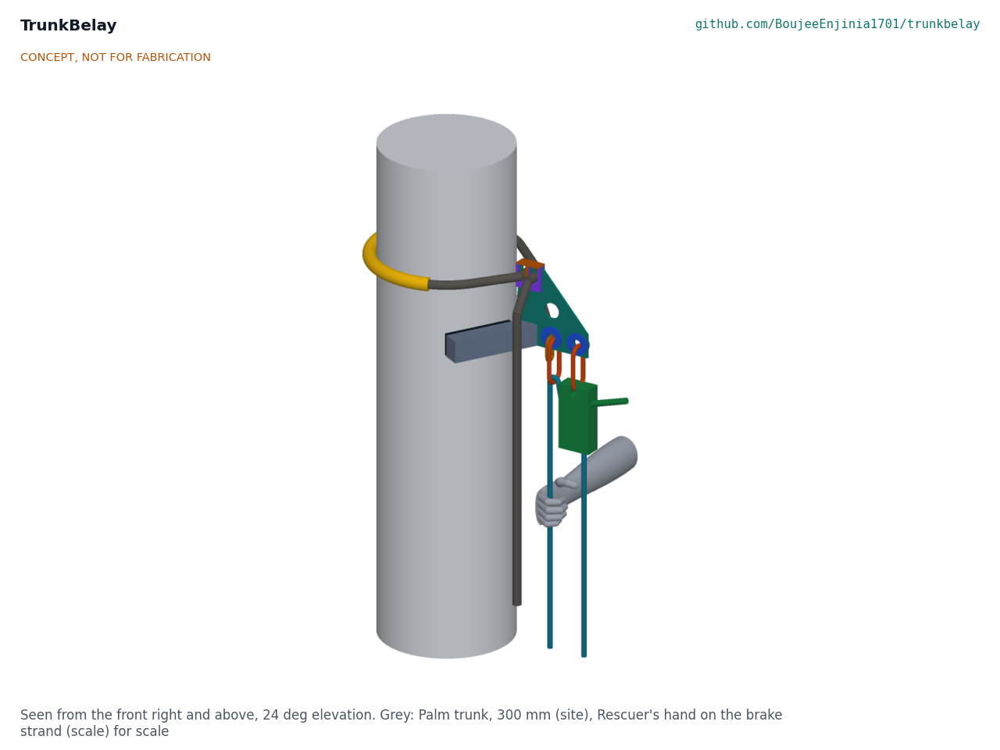
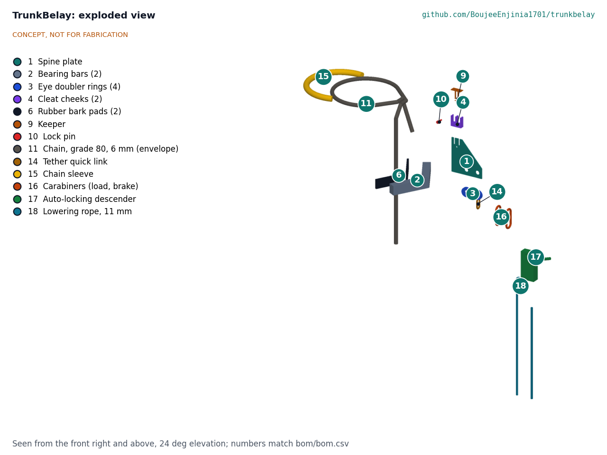

# TrunkBelay design precis

Lets a fellow climber anchor and lower a climber stranded high on a palm trunk.

*Figure 1. The collar on a 300 mm trunk, seen from the front right and above. The grey hand on the brake strand gives the scale.*

## How it works

TrunkBelay is an aluminium collar that grips a palm trunk harder the more load hangs from it, with a commodity rope descender clipped to it. The rescuer climbs on their own climbing device to just below the stranded climber, carrying the collar, the chain and the descender (about 4.6 kg) and a micro pulley with a 4 mm tag line running through it to the helpers on the ground, and works in four stages.

1. **Fix the collar.** The rescuer holds the collar frame against the trunk, with its two rubber-faced bearing bars touching the bark, passes the chain round the trunk, drops a link into the open slot on top of the frame, pulls the chain snug and slips the keeper and lock pin on. The frame is set at least 300 mm above the point where the rope will meet the victim.
2. **Rig the lowering.** The helpers haul the rope bag up on the tag line. The descender is clipped to the load eye at the outer end of the frame and the rope reeved through it. The brake strand turns over a carabiner on the spare eye and runs down to the rope bag, which is lowered to the helpers on the ground.
3. **Take the weight.** The victim set comes out of the bag pre-rigged: the rope's end loop, the triangle's two waist loops and one end of the chest sling are already on the victim carabiner. The rescuer fits the triangle round the victim's hips and the sling round the chest, makes the last two clips (the crotch loop and the sling's free end) and pulls all slack through the descender, which locks.
4. **Free and lower.** The rescuer frees the victim's feet from the climbing device. The victim turns head up in the triangle and hangs from the collar. The rescuer opens the descender with its handle and lowers the victim to the helpers, holding the brake strand. The rescuer then takes the kit down and descends on their own device.

The load eye sits 150 mm out from the frame. The pull of the rope on the eye tilts the frame on the trunk: the bearing bars press the bark low on the near side and the chain presses it high on the far side. The friction at those two places rises in step with the load, so the collar is self-locking, like a drawer that jams when it is pulled from one corner (TKB-CAL-001, section B).

*Figure 2. Exploded view; numbers match bom/bom.csv.*

## Components

*Table 1. Components and their BOM lines.*

| BOM | Component | Role |
| --- | --- | --- |
| 1 | Spine plate | 5 mm 6082-T6 aluminium plate in the frame's centre plane: carries the bearing bars at its foot, the chain slots at its top and the load and spare eyes at its outer end |
| 2 | Bearing bars (2) | 50 x 40 x 3 mm aluminium box section set in a 120 deg V at the foot of the spine; they bear on the bark through the pads |
| 3 | Eye doubler rings (4) | Thicken both eyes to 13 mm so a carabiner bears on a rounded, wide edge |
| 4 | Cleat cheeks (2) | 8 mm aluminium; stiffen the slotted top of the spine; notched so the chain links bear on the 5 mm web |
| 5 | TIG welding | The frame is one TIG-welded aluminium piece, left bare |
| 6, 7, 8 | Rubber bark pads (2), screws, adhesive | 10 mm rubber on each bar spreads the load on the bark and adds grip |
| 9, 10 | Keeper and lock pin | Hold both chain links down in their slots |
| 11 to 14 | Chain set | 6 mm grade 80 chain, 110 links, with a master link on the adjustable end and a quick link tethering the fixed end to the spare eye |
| 15 | Chain sleeve | 600 mm of tubular webbing on the chain where it bears on the back of the trunk |
| 16 | Carabiners (3) | Load eye to descender, brake redirect, victim connector |
| 17 | Auto-locking descender | Controls the lowering; locks if the rescuer lets go |
| 18 | Lowering rope | 30 m of 11 mm semi-static rope |
| 19, 20 | Evacuation triangle and chest sling | Hold the victim head up once the feet are freed |
| 21 | Rope and carry bag | Holds the rope and the pre-rigged victim set; hauled up on the tag line, then lowered to the ground with the spare rope |
| 22, 23 | Tag line and micro pulley | 55 m of 4 mm cord doubled through a micro pulley on the rescuer's harness; the helpers haul the bag up on it |

## Key design choices

All were made under Amish's pre-approval of 2026-10-03 and are recorded in TKB-DDR-001 and TKB-DDR-002. Amish decided the four requirement questions on 2026-10-03 (TKB-DDR-003): "i agree with all the 46 recommendations you provided. please proceed."

- **Self-locking frame, not a tightened band.** The grip comes from the load's lever on the frame, so it does not depend on how hard the rescuer pulled the chain. The chain only has to be snug.
- **A V of two bars, not a curved saddle.** A 120 deg V touches any trunk from 200 to 450 mm on two lines and centres itself; a curved saddle fits only one size.
- **A generic slotted cleat, no ratchet.** Chain links drop into two plain slots in the spine top and are held by a keeper and pin. This keeps clear of the ratcheting cinch geometry of the 3M DBI-SALA Cynch-Lok (the patent design-around) and has no moving parts to clog with bark.
- **Auto-locking descender.** The conservative choice: if the rescuer is hit, faints or lets go, the descender holds the victim.
- **Brake strand to the ground.** The spare rope goes down to the helpers, so the rescuer does not manage a rope bag at height.
- **Aluminium, TIG welded (decision 18C).** 6082-T6 plate and box section, sized on the weaker metal beside the welds; it takes about 1.9 kg off the climb compared with the same parts in steel. It needs an AC TIG welder rather than a stick welder, and nothing is galvanised.
- **The bag comes up on a tag line (decision 18C).** The rescuer carries only what fixes the collar and controls the lowering; the helpers haul the rope and the victim set.
- **Victim set packed pre-rigged (decision 17B).** Saves about 45 s at height, which offsets the time the haul takes.
- **The collar always goes above the victim's attachment (decision 16A).** The collar holds only a downward pull, so the drill keeps it at least 300 mm above the point where the rope meets the victim; a double-acting collar is the recorded fallback.
- **The safe rescue gear stays (decision 19A).** The auto-locking descender and the evacuation triangle are kept; cost is to come down through group purchase, not by cheaper gear.

## First-order numbers

From TKB-CAL-001; assumptions are stated there.

*Table 2. Key figures (estimates).*

| Quantity | Value |
| --- | --- |
| Trunk range | 200 to 450 mm across, no tools |
| Working load on the collar, 100 kg person | 0.99 kN |
| Static load the collar is sized for (R1) | 2.5 kN |
| Friction needed to lock, 200 mm trunk (worst) | 0.58, against about 0.9 assumed on wet bark; locking factor 1.54 |
| Frame settles under 2.5 kN | About 10 mm |
| Strength at 2.5 kN | Frame 1.55 times its welded proof strength or better; chain 8.1 times its breaking force; rope 5.7 times at the knot |
| Hand force on the brake strand, 100 kg | About 80 N |
| Rope | 30 m; 28 m needed for a 25 m lowering |
| Rigging time once in position | About 4.5 minutes (estimate), the haul included |
| Mass | 4.55 kg carried up the trunk; 3.7 kg bag hauled up; 8.3 kg in all |
| Cost | Value-engineering target: USD 900. Estimated cost of the constructable design: USD 826 (USD 74 under the target); R9 as restated, USD 850 |

## Patent design-arounds

From the preliminary patent, trademark and prior-art screen (not legal advice):

- Generic chain-and-cleat collar; avoid the 3M Cynch-Lok ratcheting cinch geometry and cleated-plate arrangement. The constructable design has no ratchet, no cam and no cleated gripping plate: plain slots, rubber-faced bars and a lever.
- CA2681870C (Bashlin) lapsed in 2015; WO2012131439A1 ceased; neither blocks the concept.

## Shared blocks

- CalRig proof-load (collar slip and proof tests on trunk sections)
- PalmSpan collar data (shelved sibling), for grip across palm sizes

## Safety

> **Safety:** TrunkBelay is rope rescue and work-at-height equipment. A slip of the collar, a wrongly fitted triangle or a lost brake hand can drop a person from 6 to 25 m. It is published as an open engineering reference, not certified rescue or fall-protection equipment.
>
> - Only people trained in the drill use it, and they practise at low height first.
> - Always call emergency services as well; TrunkBelay is for the minutes before they arrive.
> - The collar is not used on a person before it has been proof-tested at 2.5 kN on cut trunk sections and the drill has been run with a dummy at low height (TRL 4). The build plan's safety stops gate both.
> - The collar is loaded gently. All slack is taken in before the victim's feet are freed, so the victim never drops onto the collar (TKB-CAL-001, A2).
> - The collar is set above the point where the rope meets the victim, so it is never pulled upward.
> - A person hanging head down for a long time needs medical assessment after rescue.

This design is published as an open engineering reference. It is not certified equipment.
