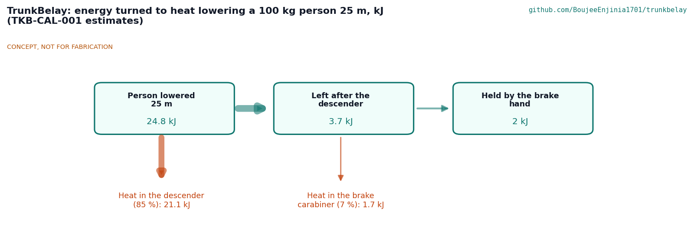

# TrunkBelay sizing calculations

On paper, the constructable TrunkBelay collar locks on every trunk from 200 to 450 mm with a locking factor of 1.54 or more, holds the 2.5 kN load of R1, and lets one rescuer lower a 100 kg person 25 m with about 80 N at the brake hand. Since Amish's round 2 decisions (TKB-DDR-003) the frame is TIG-welded aluminium 6082-T6 and the helpers haul the rope bag's contents up on a tag line, so the rescuer carries 4.74 kg against the 5 kg target. Its weak points are friction, the aluminium cleat and cost: the lock rests on an assumed friction on wet bark that must be measured first; the 5 mm aluminium cleat web has a factor of only 1.1 on its heat-affected proof strength at the R1 load (open question O5); and the kit costs USD 802 against a USD 100 per-kit target, which Amish has accepted (decision 44 A). Every figure below comes from `docs/04-calcs/sizing.py`, which imports the parametric model (`cad/src/model.py`), so the sizes here are the sizes in the STEP file, the drawings and the build plan. Tags in square brackets ([A1], [B4] ...) match the script output and `results.csv`.

These are first-principles screening estimates for a paper proof of concept. They do not replace a proof test of the collar on cut palm trunk sections or a timed drill, which are TRL 4 work.

> **Safety:** TrunkBelay holds and lowers a person at height. These numbers are for a design review only. The kit is not certified rescue or fall-protection equipment, and nobody is lowered with it before the collar has been proof-tested at 2.5 kN on cut trunk sections and the drill has been run with a dummy at low height.

## 1. Assumptions

*Table 1. Assumptions.*

| # | Assumption | Value | Basis |
| --- | --- | --- | --- |
| 1 | Design person | 100 kg, plus 0.96 kg of triangle, sling and carabiner | TKB-REQ-001, R2 and R5 |
| 2 | Static load the collar is sized for | 2.5 kN (R1) | TKB-REQ-001, R1 |
| 3 | Friction on wet coconut bark | Rubber pad 0.5; webbing-sleeved chain 0.4 | Judgement for rubber and nylon on wet fibrous wood; first item to measure (TKB-DDR-002, A1) |
| 4 | Lever height | The chain line above the bottom edge of the bars, 160 mm (conservative: the bars bear at their bottom edge as the frame cocks) | Model |
| 5 | Pad rubber | 60 to 70 Shore A, compression modulus 6 MPa, contact patch 40 mm wide on a round trunk | Rubber class |
| 6 | Frame aluminium | 6082-T6: 0.2 % proof 260 MPa in the parent metal, 125 MPa in the heat-affected zone of a TIG weld (about 30 mm each side for parts up to 6 mm thick); ER5356 weld metal 210 MPa. Every highly loaded frame section is within 30 mm of a weld, so every frame check uses 125 MPa. Acceptance: a factor of 2.0 or more at the R1 load, as the steel frame had | EN 1999-1-1 values; BOM lines 1 to 5; TKB-DDR-003 |
| 7 | Chain | 6 mm grade 80: working load limit 11.2 kN, minimum breaking force 45 kN, 0.80 kg/m | Catalogue class |
| 8 | Rope | 11 mm EN 1891 type A: at least 22 kN, 65 % at a figure-eight loop, 4 % stretch from 50 to 150 kg, 78 g/m | Standard minimum and catalogue class |
| 9 | Descender | Rope friction 0.2 over 540 deg of contact (ratio 6.6) | Conservative; confirm with the maker's data |
| 10 | Carabiners | Aluminium, class B, 25 kN on the long axis, 85 g | EN 362 class |
| 11 | Bark | No cut below 2 MPa under rubber; the outer coconut stem is far stronger in crushing | Judgement; inspected at TRL 4 (R8) |

## 2. Loads [A]

- [A1] Holding a 100 kg person, the collar carries 0.99 kN. The R1 load of 2.5 kN is 2.5 times that.
- [A2] If slack is left when the feet are freed, the person drops onto the rope. On 1 m of rope a 30 mm drop gives about 2.6 kN, 50 mm 2.9 kN and 100 mm 3.4 kN. The drill takes all slack through the descender first, so the drop stays under 30 mm; the strength factors in section 4 cover the small excess over 2.5 kN.

## 3. Grip on the trunk [B]

The collar is self-locking. The load hangs from the load eye at a distance e from the trunk axis; the chain holds the frame at a height h above the bottom of the bars. Taking moments, the bars press the bark with a force N = W e / h and the chain presses the far side with the same force. Friction at both places holds the frame if (friction at the pads + friction at the chain) x N is at least W, that is if the combined friction is at least h / e. The ratio of the friction available to the friction needed is the locking factor. It does not depend on the load: the grip rises in step with it.

*Table 2. Grip at the R1 load of 2.5 kN.*

| Trunk | Load line from the axis | Friction needed | Locking factor | Bars press (each pad) | Chain tension |
| --- | --- | --- | --- | --- | --- |
| 200 mm [B1] | 273 mm | 0.58 | 1.54 | 4.3 kN (2.5 kN) | 3.3 kN |
| 300 mm [B2] | 331 mm | 0.48 | 1.86 | 5.2 kN (3.0 kN) | 4.2 kN |
| 450 mm [B3] | 418 mm | 0.38 | 2.35 | 6.5 kN (3.8 kN) | 5.5 kN |

- [B4] The smallest locking factor is 1.54, on the smallest trunk. The friction of the chain's full wrap round the trunk is extra and is not counted.
- [B5] Under 2.5 kN the pads squash about 3.1 mm (1.9 MPa) and the chain seats up to 2.9 mm; the frame drops about 10 mm as it cocks, inside the 20 mm of R1.

The lock depends on assumption 3. If the combined friction on a wet 200 mm trunk were below 0.58, the collar would slide. Measuring it is the first TRL 4 task.

## 4. Strength at the R1 load [C]

The frame is aluminium 6082-T6, TIG welded (TKB-DDR-003). Welding softens 6082-T6 beside the weld to about half its strength, and every highly loaded section of this small frame lies beside a weld, so each check below uses the heat-affected proof strength of 125 MPa.

- [C1] Bearing bars, 6082-T6 RHS 70 x 30 x 5: 0.48 kN m at the spine weld on the 450 mm trunk, 61 MPa, factor 2.0 at the R1 load (5.2 at the working load).
- [C1a] The option as first costed made each steel part 40 % thicker in aluminium, which for the bar is RHS 50 x 25 x 3.5. In the heat-affected zone that bar would carry 135 MPa, a factor of 0.92: it would yield below the R1 load. The bars are therefore RHS 70 x 30 x 5. The section is limited to 30 mm deep so the bar clears the spare eye's doubler ring, and to 70 mm high so it clears the chain's fixed-end tail; the model's 213 constructability checks pass.
- [C2] Bar-to-spine fillet welds, 4 mm all round: 52 MPa against 125 MPa beside them, factor 2.4.
- [C3] Spine arm: 8 MPa beside the lightening hole. The load eye is 17 mm thick with its 6 mm doubler rings; bearing under the carabiner bar is 15 MPa and the tear-out strength 34 kN, 14 times the R1 load.
- [C4] Chain cleat at 5.5 kN of chain tension: the 5 mm web beside a slot, loaded by the next link, 113 MPa, a factor of 1.1 in the heat-affected zone (2.3 on the parent metal, 2.8 at the working load). The steel frame had 3.1. The web cannot be made thicker, because a chain link must span it. The twist between the two slots, 0.16 kN m, gives 35 MPa in the top stiffened by the 8 mm cheeks (factor 2.0 in shear). The cleat is open question O5 in TKB-DEC-001.
- [C5] Chain: 5.5 kN at most, factor 8.1 on its breaking force and under half its working load limit; 2.2 kN at the working load.
- [C6] Rope: about 14 kN at the figure-eight loop, factor 5.7 at the R1 load and 14 at the working load. Carabiners: factor 10 and 25.

## 5. Lowering [D]

- [D1] The descender's friction ratio of 6.6 and the 180 deg turn over the brake carabiner (1.87) leave about 80 N at the brake hand for a 100 kg person, inside the 150 N of R5. Without the brake carabiner the hand would hold about 150 N, at the limit, which is why the brake carabiner is part of the design.
- [D2] A 25 m lowering at 0.3 m/s takes 83 s and turns 24.8 kJ into heat: 85 % in the descender, 7 % in the brake carabiner and 8 % at the hand. If the descender kept it all it would warm by at most 44 K.

*Figure 1. Energy turned to heat lowering a 100 kg person 25 m (estimates).*

## 6. Fit, reach and rigging [E]

- [E1] Rope: 25 m of lowering, 1 m from the descender to the person at the start, 1.5 m for the knots and 0.5 m round the brake carabiner: 28 m of the 30 m.
- [E2] Fit: on a 200 mm trunk the chain loop is 769 mm, the pads touch 58 mm along their faces and the spine is 23 mm clear of the bark; on 300 mm, 1,086 mm, 87 mm and 31 mm; on 450 mm, 1,563 mm, 130 mm and 43 mm. The 110-link chain leaves at least 10 links of tail on a 450 mm trunk.
- [E3] Rigging time once the rescuer is in position (estimate, TKB-DDR-003): collar 60 s; haul the rope's loop end and the pre-rigged victim set up on the tag line 45 s; descender and rope 40 s; fit the pre-rigged triangle and chest sling 75 s (45 s saved by packing them on the victim carabiner); the one clip at height and taking in slack 30 s: 4.2 minutes. The bag stays on the ground, so it no longer has to be lowered (20 s).

## 7. Mass [F]

- [F1] Collar frame 1.71 kg (aluminium weldment 1.37 kg), chain set 1.88 kg, descender 0.53 kg, carabiners 0.26 kg, rope 2.34 kg, triangle and sling 0.87 kg, bag 0.45 kg, tag line 0.30 kg, shoulder pouch 0.15 kg. The whole kit is 8.5 kg.
- [F2] The rescuer carries 4.74 kg up the trunk: the collar, the descender, the load and brake carabiners, the tag line and the pouch. That is 257 g under the 5 kg of R7, a thin margin. The rope bag, the rope and the pre-rigged victim set (3.7 kg) stay with the helpers and come up on the tag line.
- [F3] The aluminium weldment (1.37 kg) saves 0.85 kg on the steel one, less than the 1.2 kg first estimated, because the bars are sized for the heat-affected zone [C1, C1a].

## 8. Bark [G]

- [G1] At 2.5 kN the pads press 1.9 MPa (0.7 MPa at the working load) and the sleeved chain 0.6 MPa: no cut is expected. Bare links outside the sleeve press about 8 MPa on a 3 mm line and may mark the bark; R8 is confirmed by inspection after the TRL 4 tests.

## 9. Cost [H]

- [H1] Value-engineering target: USD 900. Estimated cost of the constructable design: USD 802 (USD 98 under the target); USD 758 before the round 2 decisions. The aluminium parts and AC TIG welding add about USD 29 net of the steel parts, welding and galvanising, and the tag line and pouch USD 16 (estimates).
- [H2] Against R9 (parts per kit) the kit is over the value-engineering target of R9 by USD 702. The largest lines are the auto-locking descender (USD 280), the evacuation triangle (USD 140), the rope (USD 105) and the TIG welding (USD 45). Amish has kept the descender and triangle (decision 44 A); savings are sought through group purchase and one kit per climber group.

## 10. Results against the requirements

*Table 3. Requirements on paper.*

| ID | Status on paper | Basis |
| --- | --- | --- |
| R1 | Met on paper; friction to confirm; **cleat margin reduced** | Locking factor 1.54 at the smallest trunk; settles about 10 mm [B4, B5]; aluminium cleat web factor 1.1 in the heat-affected zone [C4], open question O5 |
| R2 | **At risk**, controlled by the drill rule | The single top chain cannot hold an upward pull on paper; the drill keeps the collar 300 mm or more above the person's attachment so the case does not arise (decision 41 A); the upward case is tested only as misuse at TRL 4, and the double-acting collar is the fallback if rescuers cannot reach above the attachment |
| R3 | Met | 200 to 450 mm, no tools [E2] |
| R4 | Met on paper (estimate) | About 4.2 minutes once in position [E3]; to be timed at TRL 4 |
| R5 | Met on paper (estimate) | About 80 N at the hand [D1] |
| R6 | Met | 28 m needed of 30 m [E1] |
| R7 | Met on paper, thin margin | 4.74 kg carried by the rescuer; rope bag and victim set hauled up on the tag line [F2] |
| R8 | Met on paper; to confirm | Pads 1.9 MPa, sleeve 0.6 MPa [G1] |
| R9 | **Not met**, accepted by Amish | USD 802 a kit [H2] (decision 44 A) |
| R10 | Cannot be shown on paper | Needs the training trial at TRL 4 |

Amish decided the round 1 open items O1 to O4 on 2026-10-03 (TKB-DDR-003). R2 stays at risk on paper, controlled by the drill rule; R9 stays not met by his choice. The new open item O5 (the aluminium cleat) is set out with options and a recommendation in the design decisions register (TKB-DEC-001).
