# TrunkBelay prototype build plan

**Plan, not yet built.** How to build the first proof-of-concept prototype, component by component. Building and testing to it is TRL 4 work. Decisions and items to confirm are kept in the design decisions register ([docs/06-design-decisions.md](06-design-decisions.md)), not here.

## 1. What you are building

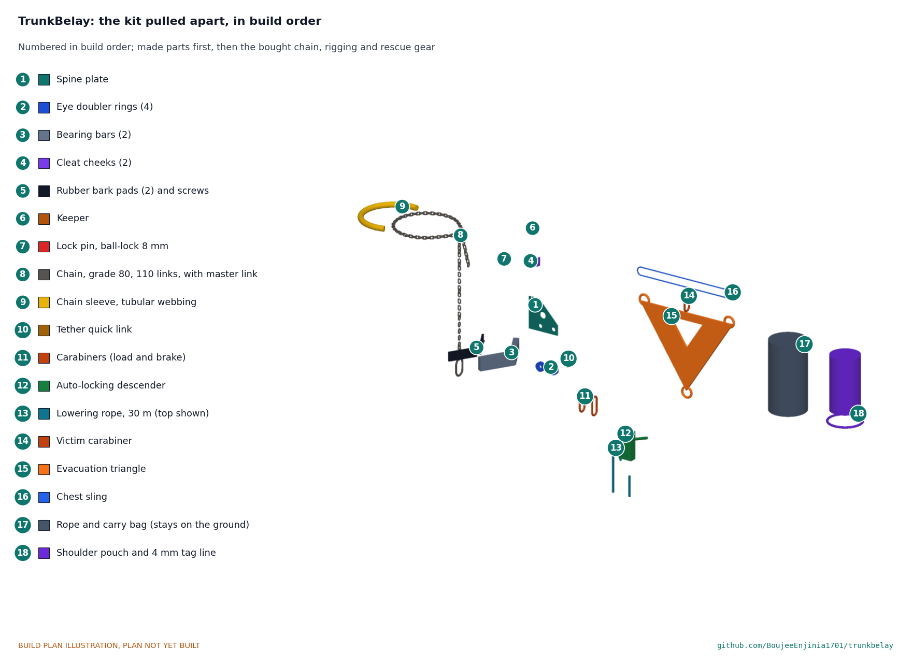

*Figure 1. Every component pulled apart and numbered in build order.*

The prototype is a rescue kit that lets one climber anchor and lower another who is stranded on a coconut palm. Figure 1 shows its 18 groups of parts in the order you make or fit them. The collar frame is one TIG-welded aluminium piece (6082-T6): a 5 mm spine plate with two rubber-faced bearing bars in a V at its foot, two chain slots in its top stiffened by a cheek plate on each face, and a load eye and a spare eye at its outer end. A 6 mm grade 80 chain wraps the trunk once and is held in the slots by a sheet-steel keeper and a ball-lock pin. An auto-locking descender, three carabiners, 30 m of rope, an evacuation triangle, a chest sling, a rope bag and a 4 mm tag line with a micro pulley complete the kit. The rescuer climbs with the collar, the chain, the descender and two carabiners, about 4.6 kg; the helpers on the ground haul the bag with the rope and the pre-rigged victim set up on the tag line. The frame parts are profile cut, drilled and TIG welded from aluminium plate and box section and are not galvanised; the pads are cut from rubber sheet; the keeper is cut and bent from steel sheet; everything else is bought. The parts cost about USD 826 from the bill of materials.

> **Safety:** TrunkBelay holds a person at height. The build involves profile cutting, drilling, TIG welding of aluminium (strong ultraviolet light and fumes; the weld zone is weaker than the parent metal) and grinding. Nothing in this plan puts a person on the kit. The first assembly is done on a 300 mm wooden test post at the bench. Nobody is lowered with it, and it is not taken up a palm, until the collar has been proof-tested at 2.5 kN on cut trunk sections and the drill has been run with a dummy at low height (the safety stops in section 6); that is TRL 4 work.

## 2. What changed to make it buildable

The concept showed what the kit does; its parts had no thicknesses, joints or fixings. Each change keeps what the kit does and is recorded in decision record TKB-DDR-002, decided by Amish under his pre-approvals of 2026-10-03. The last four rows carry out Amish's decisions on the requirements (TKB-DDR-003).

*Table 1. Changes from the concept.*

| Component | The concept had | The buildable design has | Why |
| --- | --- | --- | --- |
| Bark bearing | A padded curved plate | Two aluminium box bars, 50 x 40 x 3 mm, in a 120 deg V, each with a 10 mm rubber pad (Figures 6 and 10) | Fits every trunk from 200 to 450 mm on two lines |
| Frame | Not defined | One 5 mm spine plate carrying the bars, the chain slots and both eyes (Figure 2) | One plate ties every load together |
| Cleat | A slotted cleat | Two 7.5 mm slots, 35 mm deep, in the spine top with a notched 8 mm cheek on each face (Figure 12) | The chain pulls across the plate; the cheeks stop it twisting |
| Lock | Not defined | A bent sheet keeper over both slots, held by a ball-lock pin (Figure 12) | A link cannot lift out of its slot |
| Fixed chain end | Not defined | In the front slot, its tail tied to the spare eye with a quick link (Figure 16) | The chain cannot be dropped at height |
| Eyes | "On the collar" | 22 mm holes with a 4 mm ring welded each side, edges rounded (Figure 4) | A carabiner never bears on a thin plate edge |
| Lever | Not defined | Load eye 150 mm out from the frame's front edge; chain 160 mm above its foot | Makes the collar grip harder as the load rises |
| Chain padding | The plate | 600 mm of tubular webbing on the chain at the back of the trunk (Figure 15) | Spreads the chain's pressure on the bark |
| Brake | A friction device | Auto-locking descender, brake strand turned over a second carabiner (Figure 17) | Halves the hand force; holds if the rescuer lets go |
| Frame metal | Welded steel, galvanised | 6082-T6 aluminium, TIG welded, not galvanised; bars 50 x 40 x 3, cheeks 8 mm, spine top 10 mm higher, spare eye 15 mm further back | The rescuer carries under 5 kg (R7); sized on the weaker metal beside the welds |
| Getting the kit up | Everything carried up the trunk | The helpers haul the rope bag up on a 4 mm tag line through a micro pulley on the rescuer's harness (Figure 28) | Takes 3.7 kg off the climb (R7) |
| Victim set | Packed loose | Packed pre-rigged: rope loop, triangle waist loops and one end of the chest sling already on the victim carabiner (Figure 28) | Saves about 45 s at height (R4) |
| Collar position | Drill as modelled | Drill rule kept: the collar at least 300 mm above the point where the rope meets the victim (S6) | The collar holds only a downward pull (R2) |

## 3. Making the components

Make and check each component before the assembly step that needs it. Sizes are in millimetres. "Front" means toward the trunk; "back" means away from it, toward the load eye. Workshop tolerance is 0.5 mm unless a step says otherwise. TIG weld (AC) with ER5356 filler; fillets are 5 mm unless stated. Clean every joint with a stainless brush and solvent just before welding. Aluminium beside a weld is about half as strong as the plate, and the sizes allow for that: never add a weld the plan does not show, and never repair a cracked weld; make a new part. Grind every weld that a chain link, rope or carabiner could touch smooth and round. Mark every piece with paint marker.

### 3.1 Spine plate

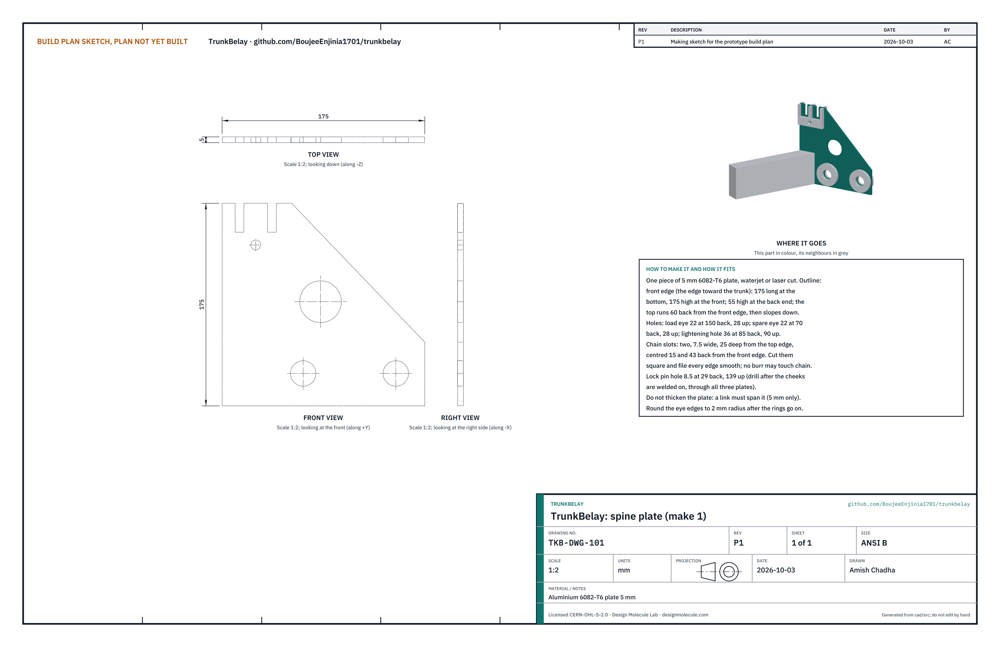

*Figure 2. Spine plate making sketch (TKB-DWG-101).*

**What it is and what it is made from.** The backbone of the collar frame. One piece of 5 mm 6082-T6 aluminium plate.

**How to make it.**

1. Have the outline profile cut (waterjet, or plasma with the edges filed back 1 mm): 175 long along the bottom, 185 high at the front edge, 55 high at the back end, the top level for 60 back from the front edge and then sloping down to the back end.
2. Have these holes cut with it: the load eye, 22, centred 150 back from the front edge and 28 up from the bottom; the spare eye, 22, at 85 back and 28 up; a 36 lightening hole at 85 back and 90 up.
3. Have the two chain slots cut down from the top edge: each 7.5 wide and 35 deep, centred 15 and 43 back from the front edge. They must be square and clean; file off every burr.
4. Do not drill the pin hole yet; it is drilled through the cheeks and the plate together (section 3.4).

**How it fits the parts next to it.** The bearing bars are welded to both faces of its foot, the eye rings round its eyes and the cheeks on both faces of its top (Figure 8). The plate must stay 5 mm: a chain link has to reach right through a slot so that the next link bears on the far face.

**Check.** A 7 mm bar slides down each slot to the bottom; a 22 mm bar passes each eye.

### 3.2 Eye doubler rings

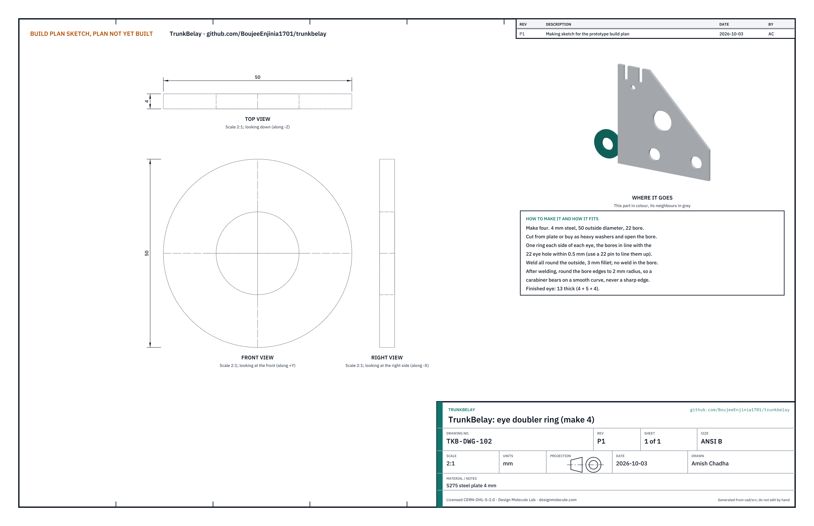

*Figure 3. Eye doubler ring making sketch (TKB-DWG-102).*

**What it is and what it is made from.** Four rings that thicken both eyes so a carabiner bears on a wide, rounded edge. 4 mm 6082-T6 aluminium, 50 outside, 22 bore. Keep them 4 mm: the 8 mm quick link has to pass round the spare eye.

**How to make it.**

1. Cut four rings from 4 mm aluminium plate. Do not use steel washers.
2. Push a 22 mm pin through an eye, slide a ring on each side and clamp them flat to the plate.
3. TIG weld round the outside of each ring with a 3 mm fillet. Keep weld out of the bore.
4. After welding, round both bore edges of each eye to a 2 mm radius with a file or rotary burr.

**How it fits the parts next to it.** Ring, plate and ring make an eye 13 thick with one smooth bore. The load carabiner (Figure 4) and the brake carabiner and quick link (Figure 16) bear on the bottom of these bores.

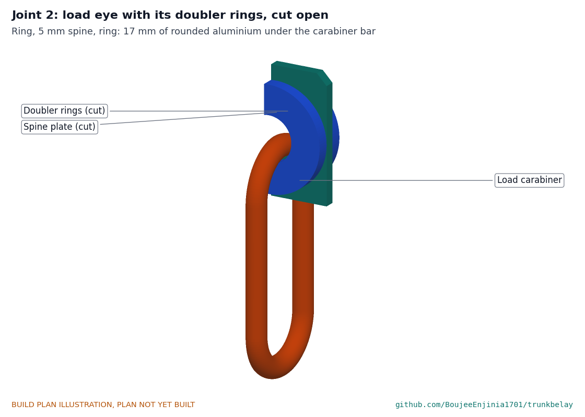

*Figure 4. The load eye cut open: ring, spine and ring under the carabiner bar.*

**Check.** The 22 mm pin turns freely in both eyes; no sharp edge can be felt in either bore.

### 3.3 Bearing bars

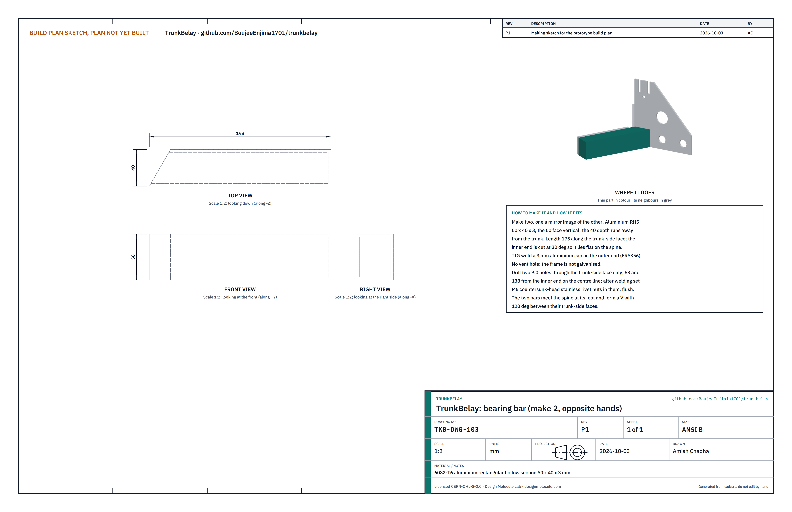

*Figure 5. Bearing bar making sketch (TKB-DWG-103).*

**What it is and what it is made from.** The two short bars that press on the bark, one a mirror image of the other. Aluminium box section, 6082-T6, 50 x 40 x 3 mm.

**How to make it.**

1. Cut two lengths so that the 50 mm face that will carry the pad (the front face) is 175 long. Cut the inner end at 30 deg from square, so it lies flat against the spine when the bar points 60 deg away from it; make the second bar the mirror image.
2. Drill two 9.0 holes through the front face only, on its centre line, 53 and 138 from the inner end, and countersink them lightly for the rivet nuts' heads.
3. TIG weld a 3 mm aluminium cap plate on the outer end, all round. No vent hole is needed: the frame is not galvanised.
4. After the frame is welded (section 3.5), set an M6 countersunk-head stainless rivet nut in each hole, flush with the face, with barrier paste on its body.

**How it fits the parts next to it.** The bars stand with their 50 mm faces upright and their bottoms level with the bottom of the spine. Their inner ends lie flat on the two faces of the spine at its foot, front faces toward the trunk, so the two front faces make a 120 deg V; if extended, they would meet 8 in front of the spine's front edge. A 5 mm fillet runs all round each bar end on the spine face (Figure 6). The back of each bar ends about 12 short of the spare eye's rings, which leaves room for both welds.

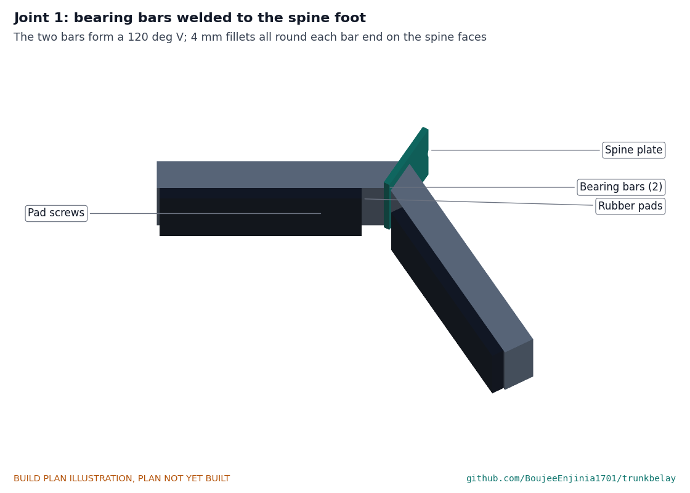

*Figure 6. Joint 1: the two bearing bars welded to the spine foot, seen from above and behind.*

**Check.** The front faces are flat within 1 mm and make 120 deg within 1 deg (use a cut card template).

### 3.4 Cleat cheeks

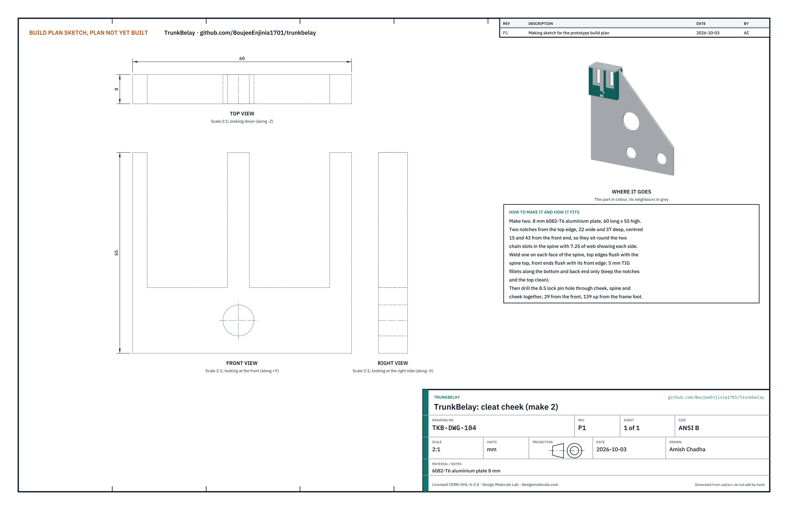

*Figure 7. Cleat cheek making sketch (TKB-DWG-104).*

**What it is and what it is made from.** Two small plates that stiffen the slotted top of the spine. 8 mm 6082-T6 aluminium plate, 60 long and 55 high.

**How to make it.**

1. Cut two plates 60 x 55.
2. Cut two notches in each from the top edge, 22 wide and 37 deep, centred 15 and 43 from the front end.
3. Clamp one on each face of the spine top, top edges flush with the spine top and front ends flush with its front edge, notches round the slots.
4. Weld along the bottom edge and the back end of each cheek only. Keep the notches and the top edge clean.
5. Drill an 8.5 hole through cheek, spine and cheek together, 29 back from the front edge and 139 up from the bottom of the frame.

**How it fits the parts next to it.** Inside each notch, 7.25 of the 5 mm spine shows on each side of the slot. That is where the chain links bear (Figure 12). The keeper's legs slide over the cheeks between the notches and the lock pin goes through the hole.

**Check.** The 8 mm pin slides through all three plates; a chain link laid flat sits inside each notch against the spine.

### 3.5 Frame weldment

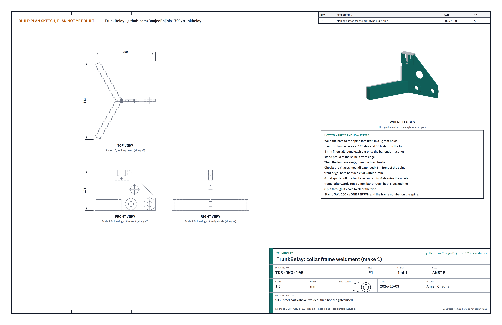

*Figure 8. Collar frame weldment making sketch (TKB-DWG-105).*

**What it is and what it is made from.** The spine, bars, eye rings and cheeks TIG welded into one aluminium piece. It is left bare: 6082 does not rust.

**How to make it.**

1. TIG weld the bars to the spine foot in a jig that holds their front faces at 120 deg and their bottoms level with the spine's bottom edge (section 3.3).
2. Weld the eye rings (section 3.2), then the cheeks, and drill the pin hole (section 3.4).
3. Clean the bar faces, the slots and the eyes with a stainless wire brush; file any weld bead that a chain link, rope or carabiner could touch smooth and round.
4. Run a 7 mm bar down both slots and an 8 mm pin through the pin hole by hand.
5. Stamp "SWL 100 kg ONE PERSON", the frame number and the year on the spine.

**How it fits the parts next to it.** It carries everything else: the pads on its bars, the chain in its slots, the keeper and pin on its top, the quick link and brake carabiner in its spare eye and the load carabiner in its load eye.

**Check.** No crack, undercut, porosity or missing weld (a dye penetrant check on the bar welds is worth the small cost); slots and pin hole clear; the frame weighs about 1.0 kg.

### 3.6 Rubber bark pads

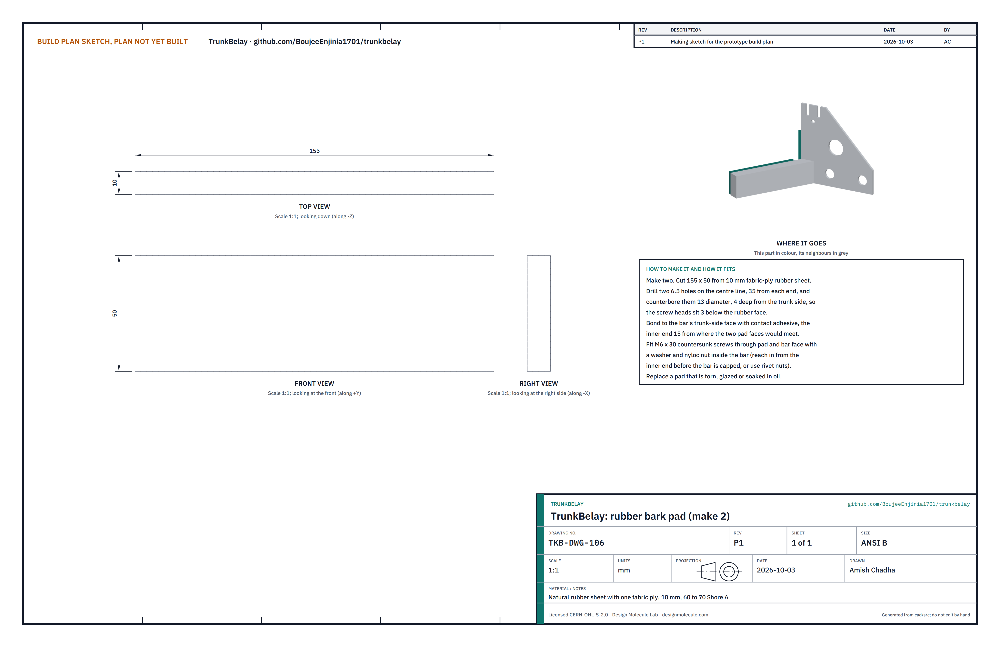

*Figure 9. Rubber bark pad making sketch (TKB-DWG-106).*

**What it is and what it is made from.** The rubber that touches the bark, one on each bar. Natural rubber sheet with one fabric ply, 10 mm thick, 60 to 70 Shore A.

**How to make it.**

1. Cut two pads 155 x 50.
2. Drill two 6.5 holes on each pad's centre line, 35 from each end, and counterbore them 13 across and 4 deep from the face that will touch the bark.
3. Spread contact adhesive on the pad and on the bar's front face, let it go tacky and press the pad on, its inner end 15 from where the two front faces would meet, its holes over the bar's holes.
4. Fit an M6 x 30 countersunk stainless screw through each hole into the rivet nut in the bar face, with threadlocker on the thread.

**How it fits the parts next to it.** The screw heads sit 3 below the rubber face, so only rubber touches the bark (Figure 10).

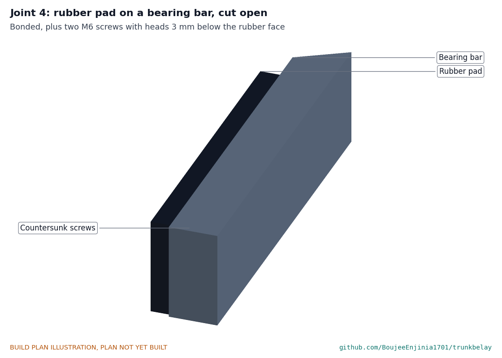

*Figure 10. Joint 4: pad bonded and screwed to the bar's front face, cut open through a screw.*

**Check.** The pad cannot be peeled at any corner; no screw head stands above the bottom of its counterbore.

### 3.7 Keeper

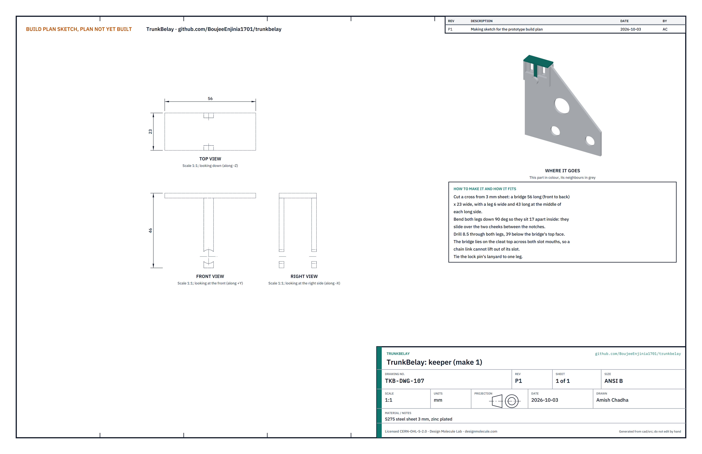

*Figure 11. Keeper making sketch (TKB-DWG-107).*

**What it is and what it is made from.** The bent sheet cover that stops a chain link lifting out of its slot. 3 mm steel sheet, zinc plated.

**How to make it.**

1. Cut a cross from 3 mm steel sheet: a bridge 56 long and 27 wide, with a leg 6 wide and 53 long from the middle of each long side.
2. Bend both legs down 90 deg in a vice so they stand 21 apart inside.
3. Drill an 8.5 hole through both legs, 49 below the top face of the bridge.
4. Have it zinc plated. Tie the lock pin's lanyard to one leg.

**How it fits the parts next to it.** The legs slide down over the two cheeks between the notches; the bridge lies on the cleat top across both slot mouths; the lock pin passes through the legs, the cheeks and the spine (Figure 12).

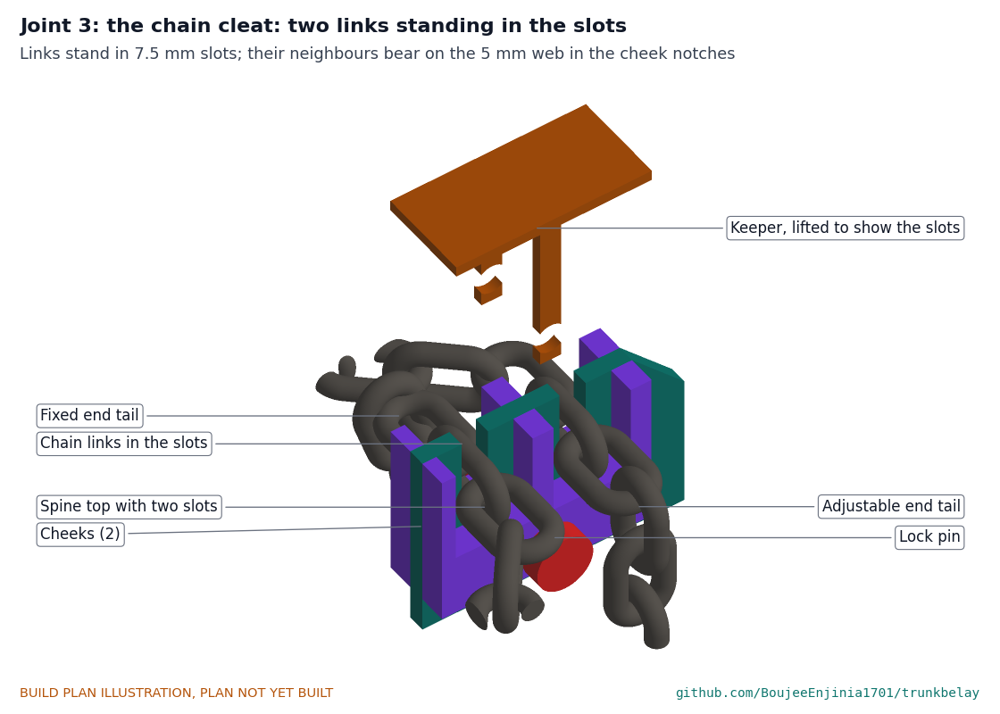

*Figure 12. Joint 3: the chain cleat. Each standing link fills a 7.5 mm slot; the flat links on either side bear on the 5 mm spine inside the notches of the 8 mm cheeks; the keeper and pin hold both links down.*

**Check.** The keeper drops on and off by hand; with it on, the pin goes through and clicks.

### 3.8 Lock pin (bought)

Buy an 8 mm stainless ball-lock pin with a 27 mm grip, a button head and a 300 mm stainless lanyard. Check that it locks through the keeper, cheeks and spine and cannot be pulled out without pressing the button. Tie the lanyard to the keeper.

### 3.9 Chain set

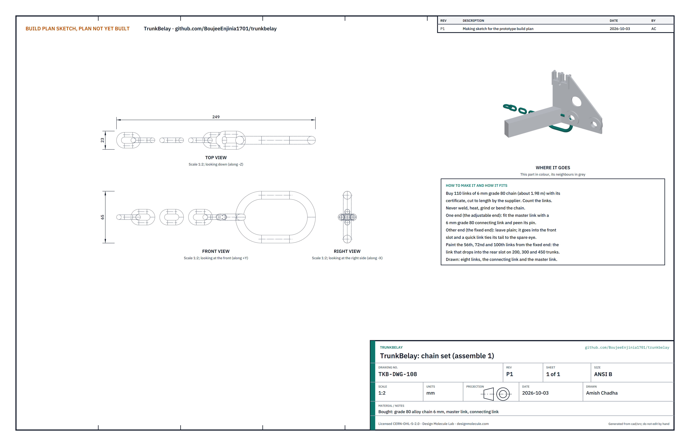

*Figure 13. Chain set making sketch (TKB-DWG-108). Eight of the 110 links are drawn.*

**What it is and what it is made from.** The chain that wraps the trunk. 6 mm grade 80 alloy chain, 110 links (about 1.98 m), with its certificate; a grade 80 master link and a 6 mm grade 80 connecting link.

**How to make it.**

1. Have the supplier cut 110 links. Count them. Never weld, heat, grind or bend grade 80 chain.
2. Feed the chain sleeve on (section 3.10) before you fit the master link.
3. Fit the master link to one end (the adjustable end) with the connecting link, and close the connecting link as its maker says.
4. Paint the 56th, 72nd and 100th links counted from the plain end (the fixed end): these are the links that drop into the rear slot on trunks of about 200, 300 and 450 mm.

**How it fits the parts next to it.** The fixed end goes into the front slot; its tail runs down to the spare eye and is tied there with the quick link (Figure 16). The chain wraps the trunk once and the adjustable end goes into the rear slot (Figure 12).

**Check.** 110 links, no damaged link, certificate kept with the kit.

### 3.10 Chain sleeve

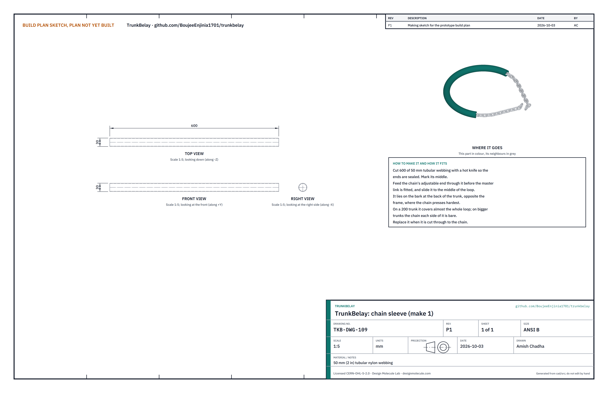

*Figure 14. Chain sleeve making sketch (TKB-DWG-109).*

**What it is and what it is made from.** A padded sleeve for the part of the chain that presses hardest on the bark. 600 of 50 mm tubular nylon webbing.

**How to make it.**

1. Cut 600 with a hot knife so both ends are sealed.
2. Mark its middle with a marker.
3. Thread the chain through it from the adjustable end before the master link goes on.

**How it fits the parts next to it.** It slides on the chain to the back of the trunk, opposite the frame (Figure 15).

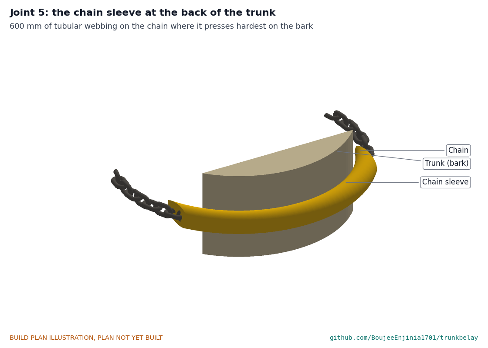

*Figure 15. Joint 5: the sleeve on the chain where it presses on the back of the trunk.*

**Check.** The sleeve slides freely along the chain.

### 3.11 Tether quick link (bought)

Buy an 8 mm zinc-plated steel screw-gate quick link. It goes through the spare eye and through the last link of the fixed end's tail, and its gate is screwed shut with a spanner, a quarter turn past finger tight (Figure 16).

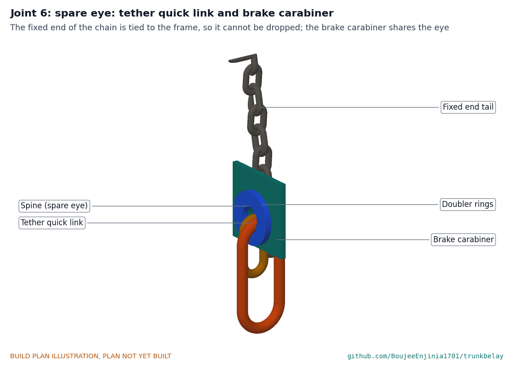

*Figure 16. Joint 6: the spare eye holds the quick link that ties the chain's fixed end to the frame, and the brake carabiner.*

### 3.12 Carabiners, descender and rope (bought)

- Three aluminium screw-gate locking carabiners, EN 362 class B or equal, 25 kN along the long axis: one for the load eye, one for the brake turn in the spare eye and one as the victim connector.
- One auto-locking rope descender with an anti-panic function, made for 10.5 to 11.5 mm rope and rated for a one-person rescue load (EN 341 class A or EN 12841 type C, or equal). Read and follow its maker's instructions for reeving and use.
- 30 m of 11 mm semi-static kernmantle rope, EN 1891 type A or equal. Tie a figure-eight loop at one end (the victim end), dressed, with a 100 mm tail, and a stopper knot at the other end.

The load carabiner hangs in the load eye with the descender on it. The rope's victim end leaves the bottom of the descender; the brake strand leaves its side, turns 180 deg over the brake carabiner in the spare eye and runs down (Figure 17).

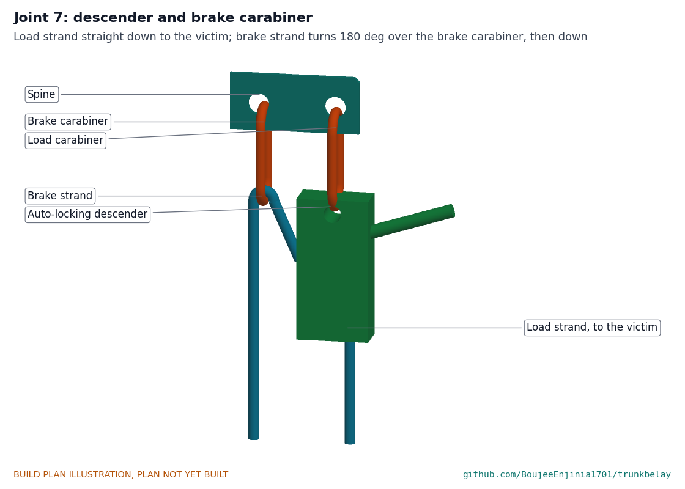

*Figure 17. Joint 7: the load strand runs straight down to the victim; the brake strand turns over the brake carabiner and runs down to the bag on the ground.*

### 3.13 Evacuation triangle, chest sling and bag (bought)

- One evacuation triangle, EN 1498 class B or equal.
- One 120 cm sewn sling, 22 kN, used as the chest sling.
- One 35 l rope bag with shoulder straps and a clip loop.

### 3.14 Tag line and micro pulley (bought)

- 55 m of 4 mm polyester accessory cord, both ends sealed with a hot knife. Tie a small figure-eight loop in one end (the bag end).
- One micro pulley for 4 to 8 mm cord, on a small screw-gate carabiner.

The pulley clips to the rescuer's harness. The cord runs through it, and both ends stay on the ground: one tied to the bag's clip loop, the other in the helpers' hands. As the rescuer climbs, the two legs of cord grow; at the top the helpers pull their end and the bag rises to the rescuer (Figure 28).

## 4. Putting it together

Assemble at the bench with the frame on a 300 mm wooden post standing upright in a vice or post holder. In each picture the parts already fitted are grey and the part being fitted is in colour, with an arrow showing the way it goes on.

### Step 1: weld the bearing bars to the spine

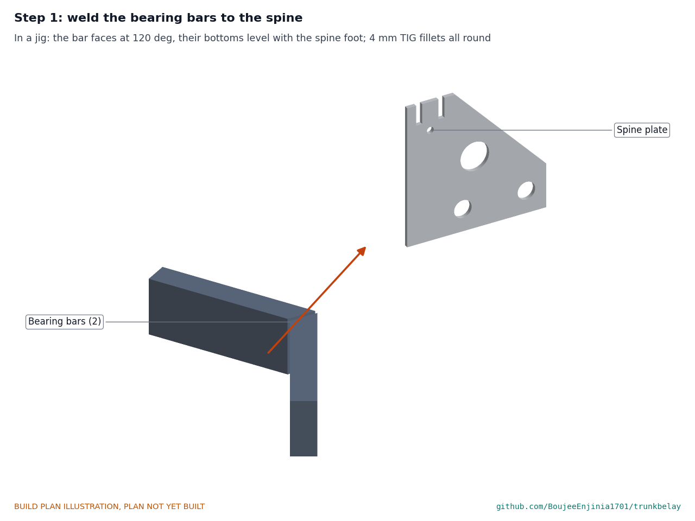

*Figure 18. Step 1: bearing bars to the spine foot.*

Clamp the spine upright in the jig and the two bars against its faces, front faces at 120 deg and bottoms level with the spine. Tack, check the angle, then TIG weld all round each bar end with 5 mm fillets.

### Step 2: weld the eye rings

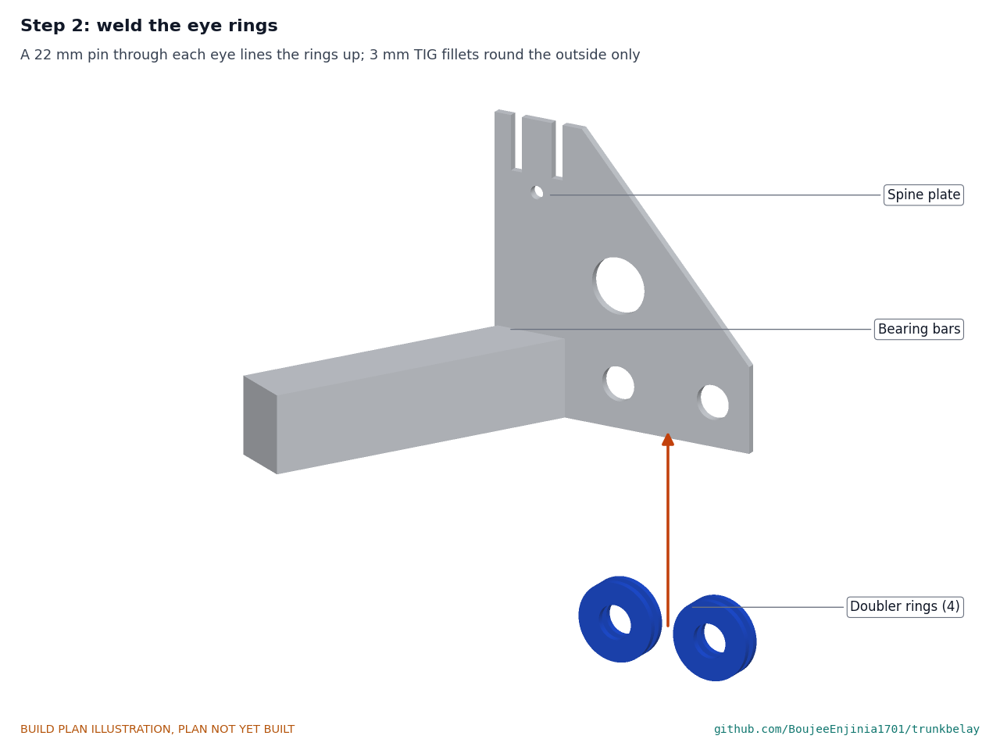

*Figure 19. Step 2: four doubler rings, two at each eye.*

Line the rings up on a 22 mm pin through each eye and TIG weld round the outside with 3 mm fillets.

### Step 3: weld the cheeks, drill the pin hole, set the rivet nuts

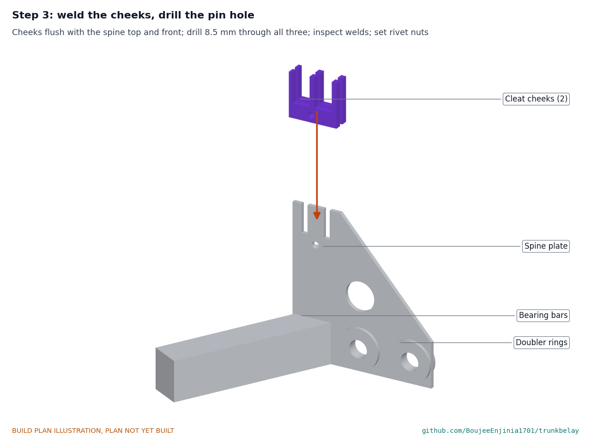

*Figure 20. Step 3: cheeks on both faces of the spine top.*

Weld the cheeks flush with the spine top and front edge, drill the 8.5 pin hole through all three plates, clean up (section 3.5) and set the four rivet nuts in the bar faces (section 3.3). **Hold point:** inspect the welds and clear the slots and pin hole before going on.

### Step 4: bond and screw the pads

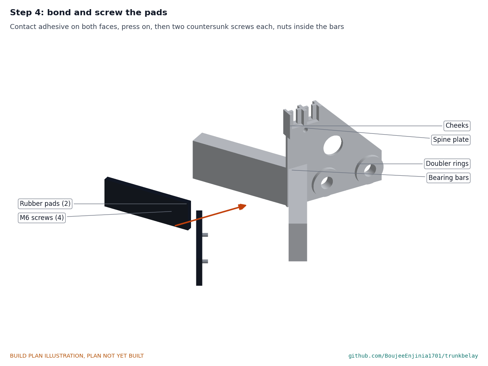

*Figure 21. Step 4: a rubber pad on each bar's front face.*

Bond each pad with contact adhesive, then fit its two countersunk screws into the rivet nuts. Leave the adhesive 24 hours before any load.

### Step 5: fit the fixed end and its tether

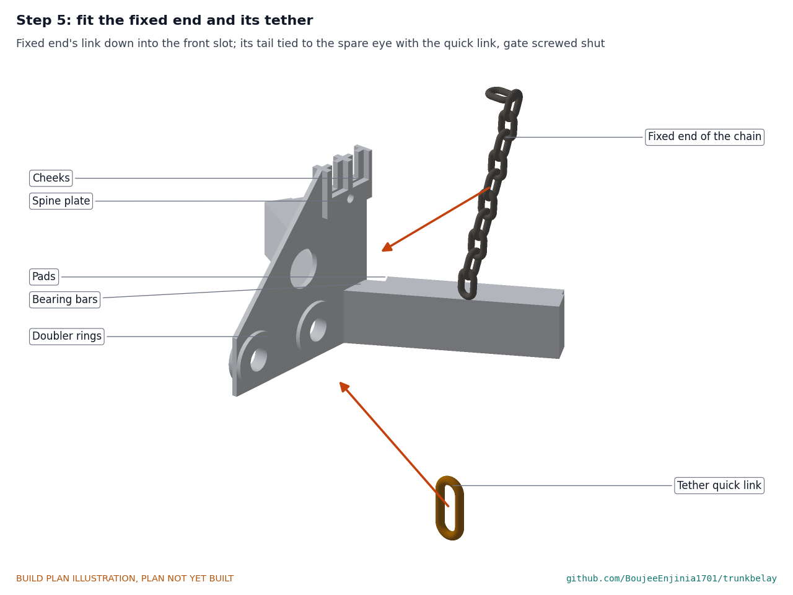

*Figure 22. Step 5: the chain's fixed end in the front slot, its tail tied to the spare eye.*

Drop the fixed end's plain link into the front slot from above so it stands upright. The tail's first link lies flat inside the notch on the spine's left-hand face (seen from the trunk); the long run of chain leaves from the right-hand face. Lead the tail down to the spare eye and close the quick link through the spare eye and the tail's last link.

### Step 6: wrap the chain round the trunk

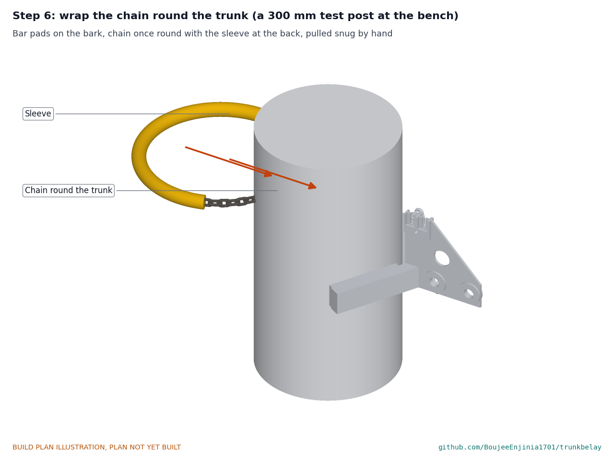

*Figure 23. Step 6: the chain wrapped once round the post, with the sleeve at the back.*

Hold the frame against the post with both pads on the wood. Pass the chain once round the post, slide the sleeve to the back and pull the chain snug by hand.

### Step 7: drop the adjustable end in, keeper on, pin in

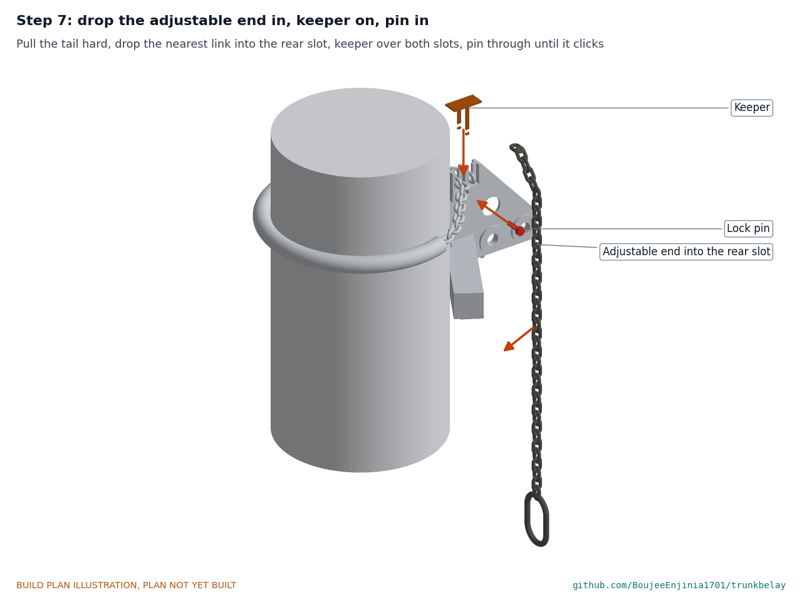

*Figure 24. Step 7: the nearest link of the adjustable end into the rear slot; keeper over both slots; lock pin in.*

Pull the adjustable end hard, drop the nearest link into the rear slot so it stands upright, slide the keeper on over both slots and push the lock pin through until it clicks. Let the tail hang on the side away from the rope. Figure 25 shows the result from above.

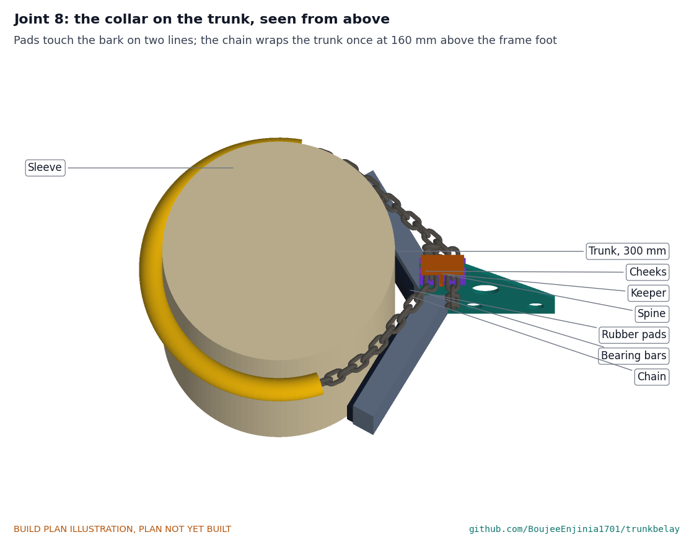

*Figure 25. Joint 8: the collar on the trunk, seen from above. The pads touch on two lines; the chain wraps once.*

### Step 8: clip on the descender

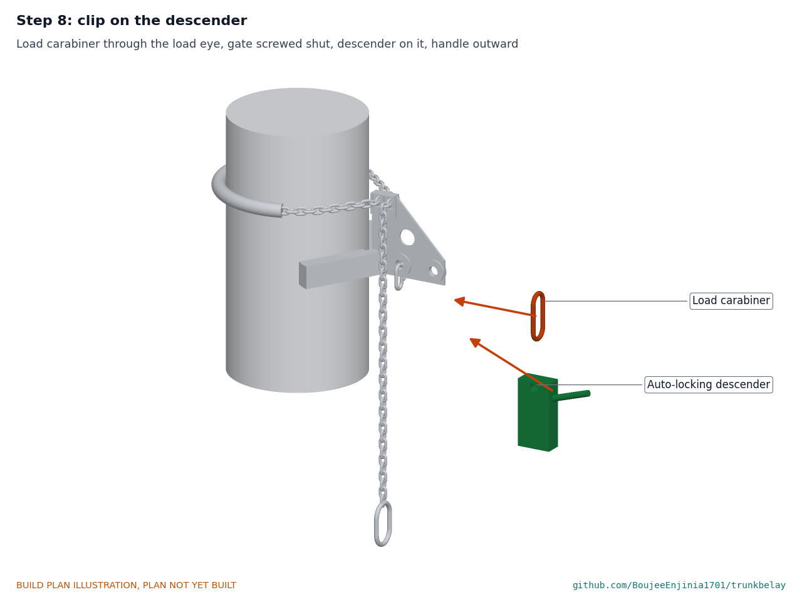

*Figure 26. Step 8: the load carabiner through the load eye, with the descender on it.*

Clip the load carabiner through the load eye, gate away from the trunk, and screw the gate shut. Hang the descender on it with its handle facing away from the trunk.

### Step 9: reeve the rope and fit the brake carabiner

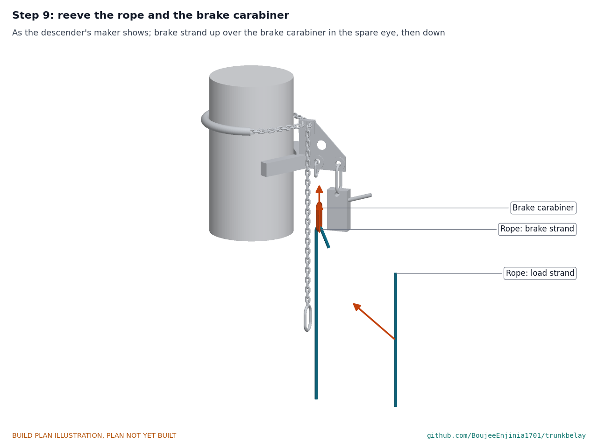

*Figure 27. Step 9: rope through the descender; brake strand over the brake carabiner in the spare eye.*

Reeve the rope through the descender as its maker shows, with the figure-eight loop on the load side. Clip the brake carabiner into the spare eye beside the quick link and lay the brake strand over it.

### Step 10: make up the pre-rigged victim set and pack

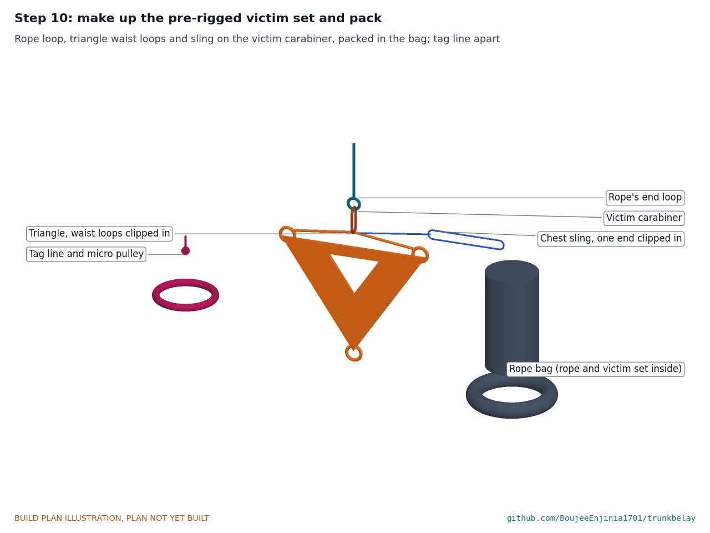

*Figure 28. Step 10: the pre-rigged victim set (the rope's loop, the triangle's two waist loops and one end of the chest sling on the victim carabiner), the bag they are packed in, and the tag line with its micro pulley.*

Clip the victim carabiner into the rope's figure-eight loop. Clip in the triangle's two waist loops and one end of the chest sling, and screw the gate shut. At height only two clips are left to make: the triangle's crotch loop and the sling's free end. Flake the rope into the bag, victim end on top, then lay the pre-rigged set on top of it, folded so it comes out ready to fit. Tie the tag line's loop to the bag's clip loop. The collar, chain, descender and the load and brake carabiners go on the rescuer's harness; the micro pulley goes on with the tag line through it.

In use, the order at height is: fix the collar; the helpers haul the bag up and the rescuer clips it to the spare eye; reeve the rope; lower the bag on its rope end; fit the triangle and sling; make the last two clips and take in all slack. The collar is always placed at least 300 mm above the point where the rope meets the victim.

## 5. First checks

These are the first checks for the TRL 4 build. The plan lists them; a TRL 4 test report records them.

*Table 2. First checks.*

| Check | Requirement | How | Pass when |
| --- | --- | --- | --- |
| Fit on the range | R3 | Fit the collar to 200, 300 and 450 mm posts or trunks, no tools | Both pads touch, the painted link drops in, keeper and pin go on each time |
| Static hold | R1 | On a cut, wet trunk section in a proof rig, hang 2.5 kN from the load eye for 3 minutes | Slip of 20 mm or less, no damage to frame or chain |
| Upward pull | R2 | Misuse test only: with the collar below a 100 kg test mass, lower the mass past the collar (rig only, no person); in the timed drill, check the rescuer can reach to set the collar at least 300 mm above the attachment | Recorded; if a rescuer cannot reach above the attachment, the double-acting collar (the recorded fallback) is built |
| Rigging time | R4 | Timed drill at 3 m with a dummy, trained climber, the bag hauled on the tag line and the victim set pre-rigged | Collar fixed and dummy clipped in within 5 minutes |
| Lowering | R5 | Lower a 100 kg test mass 10 m, measuring speed and brake hand force | Speed held under 0.5 m/s, hand force under 150 N |
| Rope | R6 | Measure the rope | 30 m, knots tied and dressed |
| Mass | R7 | Weigh what the rescuer carries up (collar, chain, descender, two carabiners, micro pulley and the tag line) and the hauled bag | Carried mass under 5 kg |
| Bark | R8 | Inspect the trunk section after the hold and lowering tests | No cut deeper than 5 mm |
| Drill | R10 | Supervised drill after a half-day session, with the training partner | Each trainee completes it |

## 6. Safety stops

Work stops at each of these points until what is listed is true.

- **S1, after welding:** every weld inspected; no crack, undercut, porosity or missing fillet; no repair weld on a crack; slots and eyes clean and smooth.
- **S2, before any load:** pads bonded for 24 hours; slots, pin hole and eyes clear; chain certificate checked; every carabiner and quick link gate screwed shut.
- **S3, before the proof test:** the proof rig holds the trunk section and the load independently of the collar, and nobody stands under or beside the load.
- **S4, before a person goes near the kit at height:** the collar has held 2.5 kN for 3 minutes on a wet cut trunk section with 20 mm of slip or less, and the frame shows no permanent bend.
- **S5, before any drill with a person:** the drill has been run with a 100 kg dummy at 3 m height, with a separate backup rope on the dummy, and the rescuers have been trained; emergency services are always called first in a real rescue.
- **S6, before every use:** keeper on and pin clicked; the painted link or the right link in the rear slot; all slack taken in before the victim's feet are freed, so the victim never drops onto the collar; the collar at least 300 mm above the point where the rope meets the victim (the collar holds only a downward pull); nobody stands under the bag while it is hauled up.

## 7. Tools, skills and workspace

- **Tools:** profile cutting (bought in), drill press with 6.5, 8, 8.5 and 22 mm bits and a 13 mm counterbore, files and a rotary burr, stainless wire brush, AC TIG welder with ER5356 filler, clamps and a simple angle jig, vice, hot knife, spanners, contact adhesive and spreader, barrier paste, paint marker, letter stamps.
- **Skills:** a welder able to make sound TIG fillets on thin aluminium box section; someone trained in rope rescue to reeve and check the descender, and to run the drills.
- **Workspace:** a fabrication bench with ventilation and screens for TIG welding, and a 300 mm wooden post held upright for assembly and fit checks.

## 8. Where the numbers come from

- Parametric model: `cad/src/model.py` (with its constructability checks) and `cad/step/trunkbelay-assembly.step`.
- General arrangement: `cad/drawings/TKB-DWG-001`; making sketches `cad/drawings/TKB-DWG-101` to `TKB-DWG-109`.
- Calculations: `docs/04-calcs/01-sizing.md` (TKB-CAL-001) and `docs/04-calcs/sizing.py`.
- Bill of materials: `bom/bom.csv`.
- Pictures: `cad/src/build_plan_media.py`.
- Decisions: `docs/decisions/0001-trl2-review-decisions.md`, `docs/decisions/0002-design-for-construction.md`, `docs/decisions/0003-amish-requirement-decisions.md` and `docs/06-design-decisions.md`.
